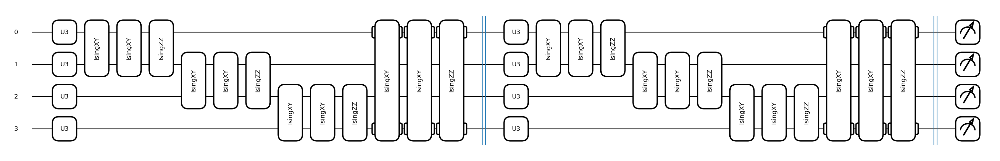
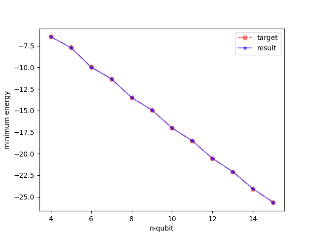
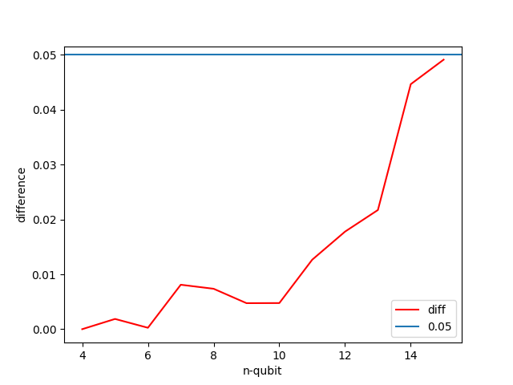
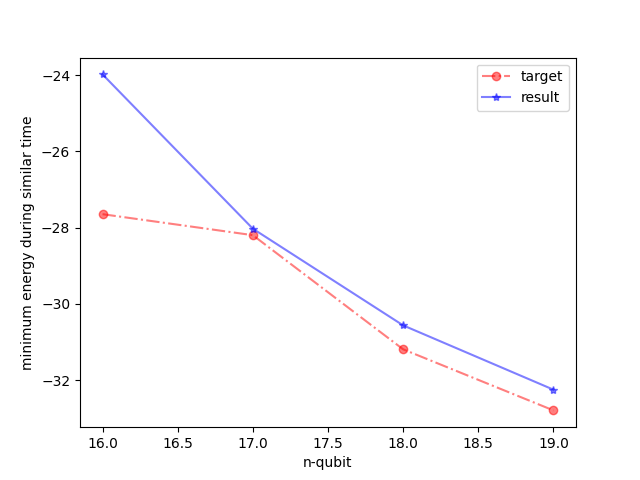
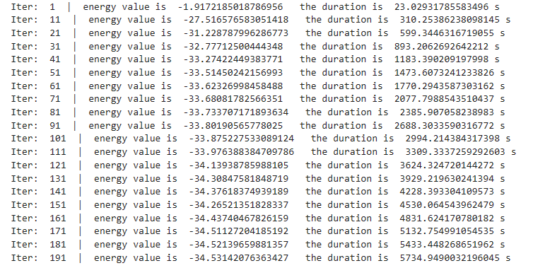

# Quantum Model for the Heisenberg Model.

Project for qhack2023

This project proposes a novel quantum circuit architecture similar to the `BasicEntanglerLayers` to optimize the Heisenberg model, we called `XYZ`-circuit.

$$
\begin{aligned}
H = \sum_{i=1}^{N} ( X_i X_{i+1} + Y_i Y_{i+1} + Z_i Z_{i+1} )
\end{aligned}
$$

- $X_i,Y_i,Z_i$ is pauli operator in qubit $i$

Assuming that the circuit consists of $n$ qubits,the model is composed of two parts:

- Each qubit is subjected to a U3 gate.
- Between the $i$-th and $(i+1)$-th qubits, there are `IsingXX`, `IsingYY`, and `IsingZZ` gates (where $(n+1) = 1$).

The following is a circuit diagram of an $4$-qubit XYZ circuit.

The cost function optimized using this model drops as shown in the following figure. It can be seen that the algorithm can reach a global minimum.

## Reaching global minumum 

We utilized `numpy` and `scipy` to compute the minimum eigenvalue of the Heisenberg model matrices for $4,5,\cdots,15$ qubits.

This minimum eigenvalue represents the global minimum of the Heisenberg model. 

Subsequently, we optimized the Heisenberg Hamiltonian using our XYZ circuit, with the following settings.

- the depth of circuit $L$: $4$ or equal to the number of qubits $n$
- initial parameters: $\theta_i \sim  \mathcal{U}[-\frac{\pi}{L},\frac{\pi}{L}]$
- optimizer:  `qml.AdamOptimizer`
- learning rate: $0.2$
- steps: $1000$

The final results indicate that the minimum energy obtained by optimization is very close to the global optimal value.

- 'target' denotes the global minumum.
- 'result' denotes the result we got from optimizing  `XYZ` circuit.

By computing the difference between `result` and `target`, we discovered that the maximum difference is not more than $0.05$.

## Time Consumption

Using the time taken to obtain the global minimum value with `sp.sparse.linalg.eigs` as a benchmark, we computed the difference between the minimum energy that can be optimized using the `XYZ` model with depth $L = 4$ and the global minimum energy for $16, 17, 18$, and $19$ qubits. 

It was observed that as the number of qubits increased, the difference tended to decrease.

## Contemporary Quantum Computing

When computing the Heisenberg model for $20$ qubits, direct eigenvalue computation may result in excessive memory allocation that renders the computation infeasible. However, using a $4$-layer `XYZ` model can optimize the Heisenberg model.

